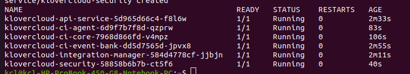

## [Architecture](https://github.com/klovercloud-ci-cd/architecture/blob/master/README.md)


## [Core Concepts](cocepts.md)
 

## Installation guide
Clone:
```couchbasequery
git clone https://github.com/klovercloud-ci-cd/documentation.git
```

Set required version:
```couchbasequery
export KLOVERCLOUD_CI_VERSION=v0.0.1
```
Install klovercloud-ci:
```couchbasequery
./files/$KLOVERCLOUD_CI_VERSION/scripts/generate.sh
```
It will ask for local database.If no then provide mongo server url and port.

```Example:
Enter mongo server:"loaclhost"
Enter mongo port:"27017"
```

Database username and password.

```Example:
Enter your mongo username:"username"
Enter your mongo password:"password"
```
Check pods statues:

```couchbasequery
kubectl get pods -n klovercloud
```
Example of a successful installation: 



Note: ```api-server``` Listens ```.git``` webhook events.  In case of local installation, ```api-server``` host and port need to be accessible from ```.git```. To accomplish this, you can use [ngrok](https://ngrok.com/) or any of the compatible tools.

Incase of ```ngrok```, please follow [this](ngrok.md) steps first.

Forward security service:
```couchbasequery
kubectl port-forward --address yourIP svc/klovercloud-security 4000:80 -n klovercloud
```

Run the following command:
```couchbasequery
./files/$KLOVERCLOUD_CI_VERSION/scripts/refactor.sh
```

Note: Forwarded api-service url will be asked. It will replace the ```.git``` url with accessable api-service url.

## Getting started
[This](https://github.com/klovercloud-ci-cd/test-app) is the example we are following.
Fork this repository.

Service account is attached with this [pipeline](https://github.com/klovercloud-ci-cd/test-app/blob/master/klovercloud/pipeline/pipeline.yaml). Service account contains two secrets; one for repository and one for registry.

Registry secret example:
```yaml
apiVersion: v1
data:
  password: <your_registry_password>
  username: <your_registry_username>
kind: Secret
metadata:
  annotations:
    tekton.dev/docker-0: https://index.docker.io/
  name: image-sec
  namespace: tekton
type: kubernetes.io/basic-auth
```

Repository secret example:
```yaml
apiVersion: v1
data:
  password: <your_repository_password>
  username: <your_repository_username>
kind: Secret
metadata:
  annotations:
    tekton.dev/git-0: https://github.com/
  name: repo-sec
  namespace: tekton
type: kubernetes.io/basic-auth
```

Service account example:
```yaml
apiVersion: v1
kind: ServiceAccount
metadata:
  name: test-sa
  namespace: tekton
secrets:
  - name: image-sec
  - name: repo-sec
```

Set env:
- Linux:
```couchbasequery
cd ~/
mkdir klovercloud
```
Export: 
```couchbasequery
vi ~/.bashrc
#add the following line and save
export KCPATH=$HOME/klovercloud/
source ~/.bashrc
```
- Windows:
Create klovercloud directory inside c drive
```couchbasequery
SET KCPATH=C:\klovercloud\
```
[N:B:] in case of windows please restart.
### Prerequisites:
- [Cli Installation](https://github.com/klovercloud-ci-cd/ctl/tree/master#readme)
```cmd
Cli to use klovercloud-ci apis!

Find more information at: https://github.com/klovercloud-ci-cd/ctl

Usage:
  cli [command]

Available Commands:
  completion  Generate the autocompletion script for the specified shell
  describe    Describe resource [company/repository/application]
  help        Help about any command
  list        List resources [company/repository/application/process]
  login       Login using email and password
  logout      Logout user from the cli
  logs        Get logs by process ID
  register    Register user
  trigger     Notify git
  update      Update resource [user/repository/application]

Flags:
  -h, --help      help for cli
  -v, --version   version for cli

Use "cli [command] --help" for more information about a command.
```


Login:
```couchbasequery
cli login -o apiserver={apiserver_url} -o security={security_url}
```
```couchbasequery
Enter email:
Enter Password:
```

Append Repository:
```couchbasequery
cli create -r file={file} option=APPEND_REPOSITORY
```

File Example:
```couchbasequery
{
  "repositories": [
    {
      "type": "GITHUB/BITBUCKET",
      "token": "your_repository_token"
    }
  ]
}
```

List Repository:
```couchbasequery
cli list -r
```
Output:
```cmd
+-------------+------------+--------------------------------------+--------+
| API VERSION |    KIND    |                  ID                  |  TYPE  |
+-------------+------------+--------------------------------------+--------+
| api/v1      | Repository | 3dc74cf2-a6c3-43e2-b088-cefe1a79ac11 | GITHUB |
+-------------+------------+--------------------------------------+--------+
```
Optionally you can set default repository:
```couchbasequery
```cmd
 cli set repo={repository_id}
```
[N:B:] If default repository is set, user don't need to provide repository id.

Append Application:
```couchbasequery
cli create -a file={file} repo={repository_id}
```
File Example:
```couchbasequery
{
     "applications": [
        {
            "_metadata": {
                "name": "test1"
            },
            "url": "https://github.com/klovercloud-ci-cd/test-app"
        }
    ]
}
```

List Application:
```couchbasequery
cli list -a repo={repository_id}
```
Output:
```cmd
+-------------+-------------+--------------------------------------+-------+---------------------+------------------+------------------------------------------------------------+
| API VERSION |    KIND     |                  ID                  | NAME  |       LABELS        | ISWEBHOOKENABLED |                            URL                             |
+-------------+-------------+--------------------------------------+-------+---------------------+------------------+------------------------------------------------------------+
| api/v1      | Application | ec3fa8ac-1242-4812-819d-54ebb8203332 | test  | compId: 12345       | false            | https://github.com/klovercloud-ci-cd/testapp               |
|             |             |                                      |       | teamId: 90000093333 |                  |                                                            |
|             |             |                                      |       |                     |                  |                                                            |
+-------------+-------------+--------------------------------------+-------+---------------------+------------------+------------------------------------------------------------+
```

Pipeline will be triggered for every repository update of specific branches.

List process:
```couchbasequery
cli list -p repo={Repository_ID} app={Application_ID}
```
Logs:
```couchbasequery
cli logs processid={Process_ID}
```

Logout:
```couchbasequery
cli logout
```
<br/>

#### [External Agent Installation](externalAgent.md)

### Welcome to KloverCloud CI/CD. Please feel free to [contribute](https://github.com/klovercloud-ci-cd/core-engine/blob/master/markdownfiles/CONTRIBUTING.md).
