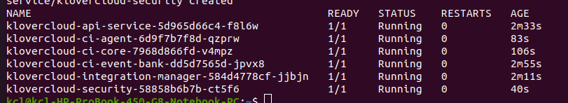

## Architecture
Klovercloud ci manages company and repositories builds docker image from git, deploys and updates k8s resources, notifies observers, allows user to listen pipeline events and logs.
-  [Read more](https://github.com/klovercloud-ci-cd/architecture/blob/master/README.md)
## Installation guide
To download generate.sh script:
```couchbasequery
wget https://raw.githubusercontent.com/klovercloud-ci-cd/documentation/main/files/scripts/v1.0.0/generate.sh
```
To run generate.sh script:
```couchbasequery
bash generate.sh
```
After run the script have to provide mongo server url and port.

```Example:
Enter mongo server:"loaclhost"
Enter mongo port:"27017"
```

Also need to provide database username and password.

```Example:
Enter mongo username:"username"
Enter mongo password:"password"
```
After successfully run the script you will get an output as below.




## Getting started
