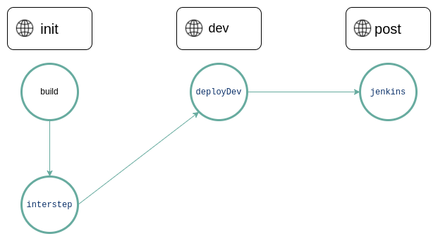

## Pipeline

Pipeline represents a projects integration and delivery flow.

Pipelines comprise:

- Jobs, which define what to do. For example, jobs that compile or test code.
- Stages, which define when to run the jobs. For example, stages that run tests after stages that compile the code.

```klovercloud/pipeline/pipeline.yaml``` file contains pipeline configuration.

## Step

Steps are jobs or tasks with successors that make a Pipeline. Pipeline steps are defined in the pipeline.yaml file. It
includes the following:

- __Build step:__ - Build step is used to compile source code, build the image and push.<br/><u>Example:</u><br/>

```yaml
 - name: build # Name of the stage.
     type: BUILD # Type of the stage.
     trigger: AUTO # Trigger of the stage.
     params: # Parameters of the stage.
       repository_type: git # Type of the repository.
       revision: master # Revision of the repository.
       service_account: test-sa # Service account to use.
       images: shabrul2451/test-dev,shabrul2451/test-pro # List of images to build.
       args_from_configmaps: tekton/cm-test # List of configmaps to use as arguments.
       args: key3:value1,key4:value2 # List of arguments to pass to the stage.
       storage: 500Mi # Storage to use.
       access_mode: ReadWriteOnce # Access mode to use.
     next:
       - interstep # Name of the next stage.
  ```

- __Intermediary Step:__ - Intermediary step is used to run container.<br/><u>Example:</u><br/>

```yaml
  - name: interstep # Name of the stage.
    type: INTERMEDIARY # Type of the stage.
    trigger: AUTO # Trigger of the stage.
    params: # Parameters of the stage.
      revision: latest # Revision of the repository.
      service_account: test-sa # Service account to use.
      images: ubuntu # Image to use.
      envs_from_configmaps: tekton/cm-test  # List of configmaps to use as environment variables.
      envs_from_secrets: tekton/cm-test # List of secrets to use as environment variables.
      envs: key3:value1,key4:value2 # List of environment variables to pass to the stage.
      command: echo "Hello World" # Command to run.
      command_args: Hello World # Command arguments.
      script: echo "Hello zeromsi" # Script to run.
      script_from_configmap: default/configmap_name # Run Script from configmap
    next:
      - deployDev
```

[N:B] For mounting script from config map in interstep, follow ```namespace/configmap_name convention``` for ```script_from_configmap params```.
Script is expected to be in data.script path:

```yaml
apiVersion: v1 # Version of the config map.
kind: ConfigMap # Kind of the config map.
metadata:
  name: script # Name of the config map.
data: # Data of the config map.
  script: | # Script to run.
    curl www.google.com
```

- __Deployment Step:__ - Deployment step is used to deploy the descriptors and modify kubernetes work loads.<br/><u>
  Example:</u><br/>

```yaml
  - name: deployDev  # Name of the stage.
    type: DEPLOY  # Type of the stage.
    trigger: AUTO # Trigger of the stage.
    params: # Parameters of the stage.
      agent: local_agent # Agent to use.
      name: ubuntu # Name of the deployment.
      namespace: default # Namespace to use.
      type: deployment # Type of the deployment.
      revision: master # If the commit is for master branch deploy job will run.
      trunk_based: enabled # If Enabled, image revision will be commit id.
      rollout_restart: true # If true, after editing resource, it will rollout restart.
      env: dev # Environment to use.
      images: shabrul2451/test-dev  # List of images to use.
    next: # List of next stages.
      - jenkinsJob
```
[N:B] As the environment name is ```dev``` ,all payloads inside ```klovercloud/pipeline/configs/dev.yaml``` file will be applied first.

- __Jenkins Job Step:__ - Jenkins job step is used to run a jenkins job.<br/><u>Example:</u><br/>

```yaml
 - name: jenkinsjob # Name of the stage.
     type: JENKINS_JOB # Type of the stage.
     trigger: AUTO # Trigger of the stage.
     params: # Parameters of the stage.
       url: http://jenkins.default.svc:8080 # URL of the Jenkins server.
       job: new  # Name of the Jenkins job.
       secret: jenkins-credentials   # Name of the secret to use.
       params: id:123,verbosity:high     # List of parameters to pass to the Jenkins job.
     next: null # List of next stages.
```

## Process

A process is an object of a Pipeline. When a Pipeline is triggered a new Process starts.

## Example of a Pipeline:

```yml
name: test # Name of the pipeline.
steps: # List of stages.
  - name: build # Name of the stage.
    type: BUILD # Type of the stage.
    trigger: AUTO # Trigger of the stage.
    params: # Parameters of the stage.
      repository_type: git # Type of the repository.
      revision: master # Revision of the repository.
      service_account: test-sa # Service account to use.
      images: shabrul2451/test-dev,shabrul2451/test-pro # List of images to build.
      args_from_configmaps: tekton/cm-test # List of configmaps to use as arguments.
      args: key3:value1,key4:value2 # List of arguments to pass to the stage.
      storage: 500Mi # Storage to use.
      access_mode: ReadWriteOnce # Access mode to use.
    next:
      - interstep # Name of the next stage.
      - jenkinsJob # Name of the next stage.
  - name: interstep # Name of the stage.
    type: INTERMEDIARY # Type of the stage.
    trigger: AUTO # Trigger of the stage.
    params: # Parameters of the stage.
      revision: latest # Revision of the repository.
      service_account: test-sa # Service account to use.
      images: ubuntu # Image to use.
      envs_from_configmaps: tekton/cm-test  # List of configmaps to use as environment variables.
      envs_from_secrets: tekton/cm-test # List of secrets to use as environment variables.
      envs: key3:value1,key4:value2 # List of environment variables to pass to the stage.
      command: echo "Hello World" # Command to run.
      command_args: Hello World # Command arguments.
    next:
      - deployDev   # Name of the next stage.
  - name: deployDev  # Name of the stage.
    type: DEPLOY  # Type of the stage.
    trigger: AUTO # Trigger of the stage.
    params: # Parameters of the stage.
      agent: local_agent # Agent to use.
      name: ubuntu # Name of the deployment.
      namespace: default # Namespace to use.
      type: deployment # Type of the deployment.
      revision: master # Revision of the repository.
      env: dev # Environment to use.
      images: shabrul2451/test-dev  # List of images to use.
    next: # List of next stages.
      - jenkinsJob # Name of the next stage.
  - name: jenkinsjob # Name of the stage.
    type: JENKINS_JOB # Type of the stage.
    trigger: AUTO # Trigger of the stage.
    params: # Parameters of the stage.
      url: http://jenkins.default.svc:8080 # URL of the Jenkins server.
      job: new  # Name of the Jenkins job.
      secret: jenkins-credentials   # Name of the secret to use.
      params: id:123,verbosity:high     # List of parameters to pass to the Jenkins job.
    next: null # List of next stages.
```

<br />

<p align="center">
  
</p>

<p align="center">
    Figure: Pipeline diagram.
</p>
