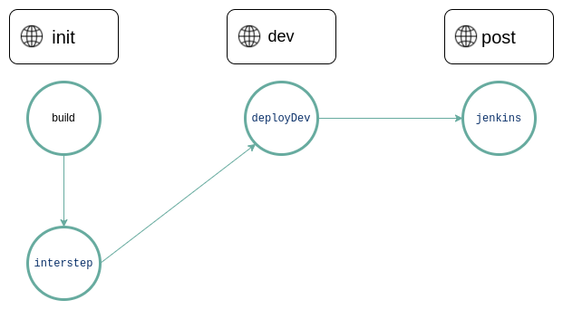

## Pipeline

Pipeline represents a projects integration and delivery flow.

Pipelines comprises:

- A list of steps.
- Step - defines what to do. For example, a step that builds image from your code.

```klovercloud/pipeline/pipeline.yaml``` file contains pipeline configuration.

## Step

Steps are jobs or tasks with successors that make a Pipeline. Pipeline steps are defined in the pipeline.yaml file. It
includes the following:

- __Build step:__ - Build step is used to build images from source code and push into registry.<br/><u>Example:</u><br/>

```yaml
 - name: build # Name of the step. This must be unique across the whole pipeline file. 
     type: BUILD # Type of the step. Case sensitive.
     trigger: AUTO # Trigger can be Auto or Manual, case sensitive. Trigger Auto means step will run without manual interactions. 
     params: # Parameters of the step.
       repository_type: git # Type of the scm.
       revision: master # Revision/commit id/branch of the repository. If provided, this will be image tag, otherwise commit id will be default. $BRANCH as variable will replace revision by branch name.
       service_account: test-sa # Service account that references source code clone and image push secret.
       images: zeromsi2/test-dev,zeromsi2/test-pro # List of images to build.
       args_from_configmaps: tekton/cm-test # Comma separated list of configmaps, convention is namespace/name of configmap. Pass arguments using configmap.
       args: key3:value1,key4:value2 # Pass argument as key and value pairs.
       env: init # name of environment
       allowed_branches: dev,master # If commits are not from these branches, pipeline won't get triggered.
       dockerfile_path: "" # Dockerfile path from base directory of the project.
     next:
       - interstep # Name of the next steps.
  ```

- __Intermediary Step:__ - Intermediary step is used to run container.<br/><u>Example:</u><br/>

```yaml
  - name: interstep # Name of the step. This must be unique across the whole pipeline file.
    type: INTERMEDIARY # Type of the step. Case sensitive.
    trigger: AUTO # Trigger can be Auto or Manual, case sensitive. Trigger Auto means step will run without manual interactions. 
    params: # Parameters of the step.
      revision: latest # Revision of the image.
      service_account: test-sa # Service account to use.
      images: ubuntu # Container image to run.
      envs_from_configmaps: tekton/cm-test  # Comma separated list of configmaps, convention is namespace/name of configmap. Mount environment variables from configmaps.
      envs_from_secrets: tekton/cm-test  # Comma separated list of secrets, convention is namespace/name of secret. Mount environment variables from secrets.
      envs: key3:value1,key4:value2 # Mount environment variables as key and value pair.
      command: echo "Hello World" # Command to run.
      command_args: Hello World # Command arguments.
      script: echo "Hello zeromsi" # Script to run.
      script_from_configmap: default/configmap_name # Run Script from configmap
      env: build # name of environment
    next:
      - deployDev
```

[N:B] For mounting script from config map in interstep, follow ```namespace/configmap_name convention``` for ```script_from_configmap params```.
Script is expected to be in data.script path:

```yaml
apiVersion: v1 # Version of the config map.
kind: ConfigMap # Kind of the config map.
metadata:
  name: script # Name of the config map.
data: # Data of the config map.
  script: | # Script to run.
    curl www.google.com
```

 #### [Intermediary steps usecases](usecases.md)

- __Deployment Step:__ - Deployment step is used to deploy the descriptors and modify kubernetes work loads.<br/><u>
  Example:</u><br/>

```yaml
  - name: deployDev  # Name of the step. This must be unique across the whole pipeline file.
    type: DEPLOY  #  Type of the step. Case sensitive.
    trigger: AUTO # Trigger can be Auto or Manual, case sensitive. Trigger Auto means step will run without manual interactions. 
    params: # Parameters of the step.
      agent: local_agent # Agent represents your cluster. Every cluster will have at least one agent running. This is the name of the agent.
      name: ubuntu # Name of the resource.
      namespace: default # Namespace of the resource.
      type: deployment # Type of the resource.
      revision: master # If the commit is for master branch, deploy job will run.
      trunk_based: enabled # If Enabled, image revision will be replaced by commit id.
      rollout_restart: true # If true, after updating resource, it will rollout restart.
      env: dev # Environment to use.
      images: zeromsi2/test-dev  # List of images to use.
    next: # List of next stages.
      - jenkins
```
[N:B] As the environment name is ```dev``` ,all payloads inside ```klovercloud/pipeline/configs/dev.yaml``` file will be applied first.

- __Jenkins Job Step:__ - Jenkins job step is used to run a jenkins job.<br/><u>Example:</u><br/>

```yaml
 - name: jenkins # Name of the stage.
     type: JENKINS_JOB # Type of the step. Case sensitive.
     trigger: AUTO # Trigger can be Auto or Manual, case sensitive. Trigger Auto means step will run without manual interactions.
     params: # Parameters of the stage.
       url: http://jenkins.default.svc:8080 # URL of the Jenkins server.
       job: test_jenkins_job  # Name of the Jenkins job.
       secret: jenkins-credentials   # Name of the secret to use.
       params: id:123,verbosity:high     # List of parameters to pass to the Jenkins job.
       env: post # name of environment
     next: null # List of next stages.
```

## Process

A process is an object of a Pipeline. When a Pipeline is triggered a new Process starts.

## Example of a Pipeline:

```yml
name: test
_metadata:
    allowed_branches: dev,master
steps:
  - name: build
    type: BUILD
    trigger: AUTO
    params:
      repository_type: git
      revision: master
      service_account: test-sa
      images: zeromsi2/test-dev,zeromsi2/test-pro
      args_from_configmaps: tekton/cm-test
      env: init
    next:
      - interstep
  - name: interstep
    type: INTERMEDIARY
    trigger: AUTO
    params:
      revision: latest
      service_account: test-sa
      images: ubuntu
      envs_from_secrets: tekton/cm-test
      command: echo "Hello World"
      command_args: Hello World
      env: init
    next:
      - deployDev
  - name: deployDev
    type: DEPLOY
    trigger: AUTO
    params:
      agent: local_agent
      name: ubuntu
      namespace: default
      type: deployment
      revision: master
      env: dev
      images: zeromsi2/test-dev
    next:
      - jenkins
  - name: jenkins
    type: JENKINS_JOB
    trigger: AUTO
    params:
      url: http://jenkins.default.svc:8080
      job: test_jenkins_job
      secret: jenkins-credentials
      params: id:123,verbosity:high
      env: post
    next: null
```

<br />

<p align="center">
  
</p>

<p align="center">
    Figure: Pipeline diagram.
</p>
